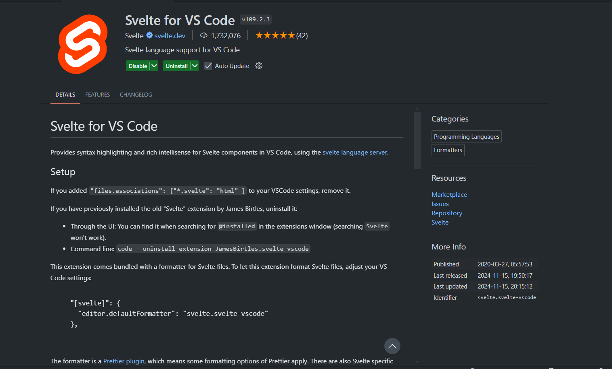
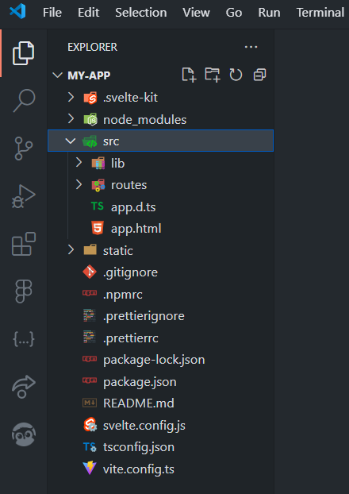
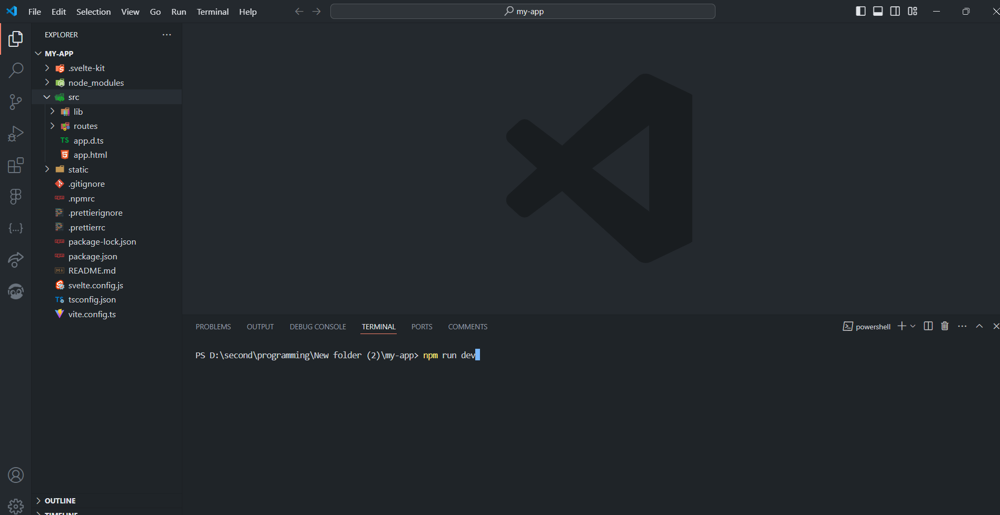
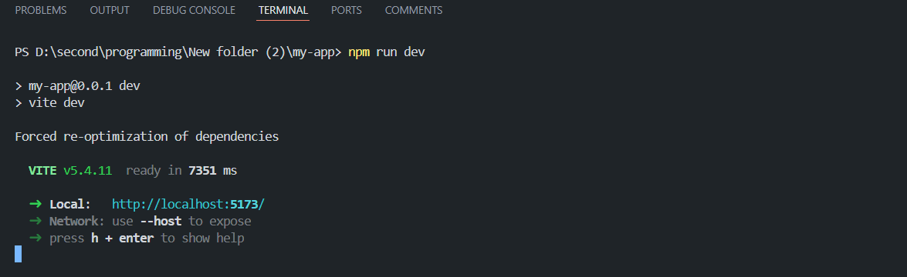

# Svelte components explained

You can see how we can create svelte files in the svelteIntro.md. In this md, we will break down what we can do in svelte components.

First, before we start, I really recommend you to download this vscode extension which is very useful when you are working with svelte: [svelte](https://marketplace.visualstudio.com/items?itemName=svelte.svelte-vscode)



___

We will spend most of our time in the `src` folder when we are working with svelte.



___

To run this code, we will use the `npm run dev` command. We will see the output in the browser.

To open the terminal, you can use the `ctrl +`\``or` cmd + \` shortcut. Or you can just open the terminal on the top bar.

in the terminal: run this command

```
npm run dev
```



___

This is what you will see:



```
http://localhost:5173/
```

is your website: you can click it or type this is your browser to open it.

___

Just like .html, .css and .js, our svelte files will be ending with .svelte.

In the routes folder, you can see the `+page.svelte` file. This is the default page that will be opened when you open your website.

In svelte, we use: Javascript or TypeScript in the `script` tag on the very top. Followed by HTML in the `main` tag and then CSS in the `style` tag.

You can see the example code below:

```
<script>
   let name = "world";
</script>

<main>
   <h1>Hello {name}!</h1>
</main>

<style>
   h1 {
      color: #ff3e00;
      font-size: 4em;
   }
</style>
```
___

In Svelte, we can also write the `class` just like some other frameworks: 

```
class:show={showState}
```
which is the same way we write as:
```
class = {showState ? 'show' : ''}
```
where `showState` is a boolean variable that we can use to toggle the class.
___

In the `lib` folder, we store our reusable components. And to reuse them, we can use special svelte feature `$/lib/` to access the lib folder without typing the whole path.

___

In svelte, we have special route files: in which we will cover in the later section.

- `+page.svelte`: The default page that will be opened when you open your website.
- `+layout.svelte`: The layout that will be used for all the pages.
- `+error.svelte`: The error page that will be shown when an error occurs.
- `+layout.server.js`: The server-side layout that will be used for all the pages.
- `+page.server.js`: The server-side page that will be used for all the pages.
___
