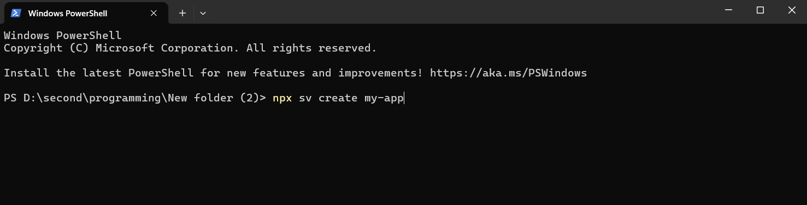
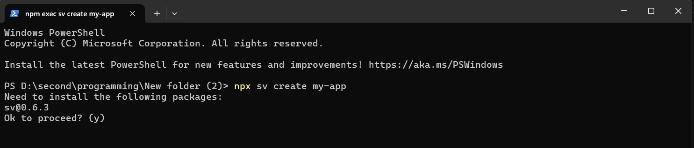
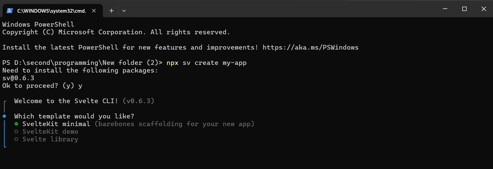
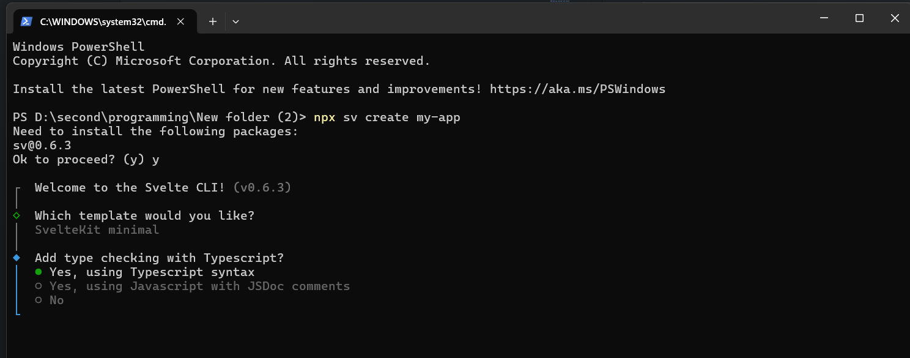
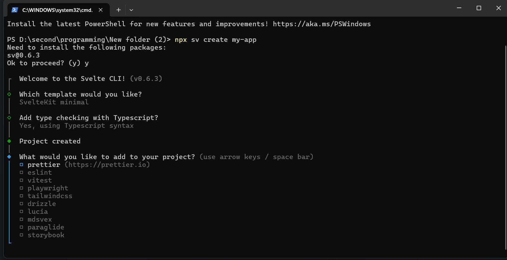
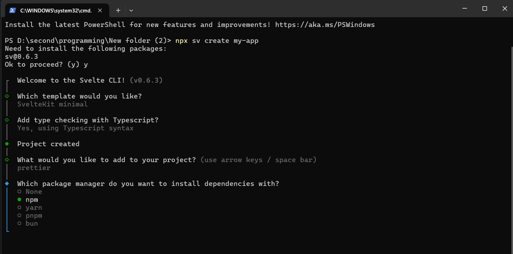
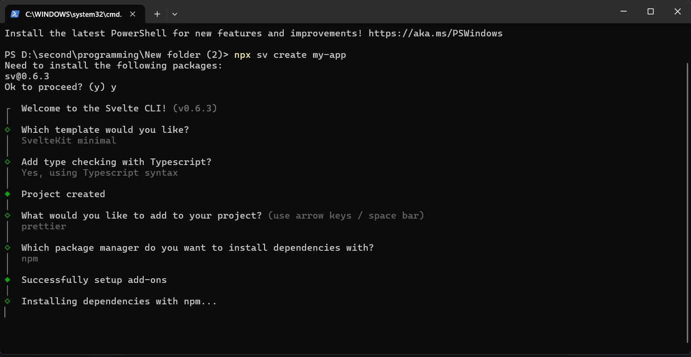
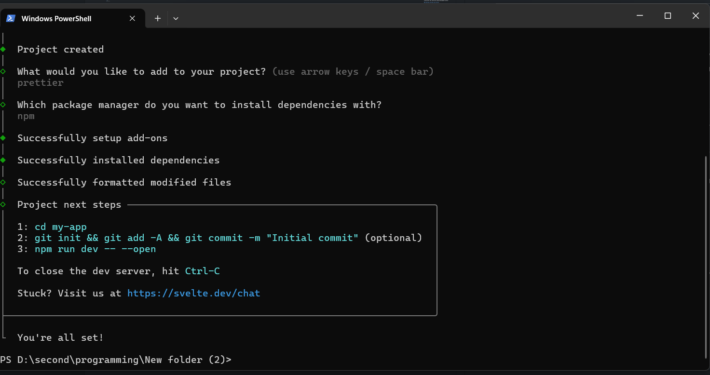
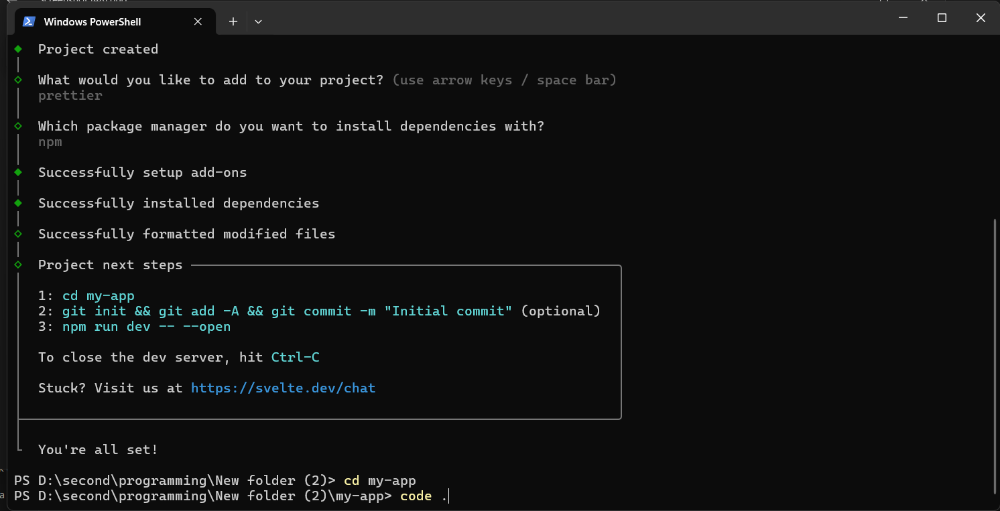

# SVELTE

## What is Svelte?

Svelte is a JavaScript framework for building fast, interactive websites. It compiles your code into efficient JavaScript, making apps smaller and faster.

## Why use Svelte?

- **Easy to Learn**: Uses simple HTML, CSS, and JavaScript, so it’s beginner-friendly.
- **Fast Performance**: No virtual DOM. Your app runs faster and loads quicker.
- **Less Code**: Svelte handles reactivity for you, so you write less code.
- **Smaller Apps**: Your app is smaller because there’s no big framework runtime.
- **Great Developer Experience**: Built-in features like transitions and reactivity make development easier.

### Getting started with Svelte

First, in any folder on your computer, open your terminal and run this command:

```
npx sv create my-app
```



`my-app` is the name of your app, which you can also say your folder that will contain all the svelte files and syntax.

---

And then we will install the packages:



in which we type y and hit enter to install the packages.

---

After that, we will be choosing one from the three options:



1. SvelteKit minimal, which will contain all the necessary files for a SvelteKit app.

2. SvelteKit Demo, which will contain all the necessary files for a SvelteKit app with a counter app and a word game.

3. Svelte library

In this case, I'm gonna choose option 1. _hit enter_

---



Now we gonna use Typescript syntax;

### Why use Typescript in svelte?

- **Catch Errors**: Finds mistakes early (e.g., wrong data types).
- **Better Autocompletion**: Helps you write code faster with smart suggestions.
- **Clearer Code**: Types make your code easier to understand.
- **Easy Setup**: Svelte works great with TypeScript right out of the box.

**Next step is optional, you can hit enter to skip to the next step.**

---



But I'm gonna choose prettier for more clear format. We use space and arrow keys to select and as many as you found useful. Then we will hit enter to install the prettier.

---



We will choose npm to run or manage this svelte framework and other dependencies in our project. You will learn more about npm and usage in the later section.

---



---



Now we will type cd my-app to change the directory to our svelte project.



now you can use

```
code .
```

to open the project in vscode. Or you can just open the folder directly in vscode.
